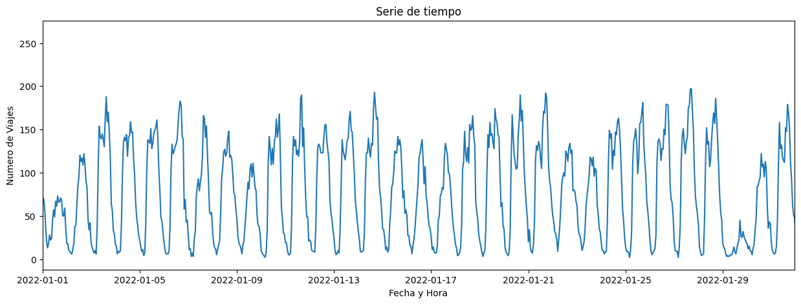

# [EDA Correlacion-Estacionalidad](EDA%20-%20Correlaciones%20viajes.ipynb)

## Como antesala del proceso de entrenamiento de Machine Learning (ML), del análisis de la data y en conformidad con los objetivos y producto ML del presente proyecto, se sugiere tratar la data como una serie de tiempo, ya que se observó que existe una estacionalidad al medir cambios en intervalos de 24 horas al dia, la cual se mantiene constante a lo largo del tiempo.

## Observacion principal:

* El rango de la muestra fue de 2 años, donde se contaron el numero de viajes por hora. Para el rango de tiempo, el numero de filas debió ser **17520**, pero fue de **17516**, lo que significa que hay 4 horas durante esos 2 años, donde hubo 0 (cero)
viajes, valores que estan ausentes.

## Para la transformacion de los datos previo al entrenamiento, se sugiere tomar en consideracion lo siguiente:

* En este EDA se contabilizaron todos los viajes, **NO hubo separacion por `PULocationID`**, por lo que puede suceder que, en especial para `PULocationID` con muy baja demanda, hayan muchos valores faltantes. **Se sugiere crear una columna con todas las horas posibles, hacer un `JOIN` con la tabla que contabiliza el numero de viajes y, en los valores nulos que resultaran de esos `JOIN`, sustituir por 0 (cero)**.