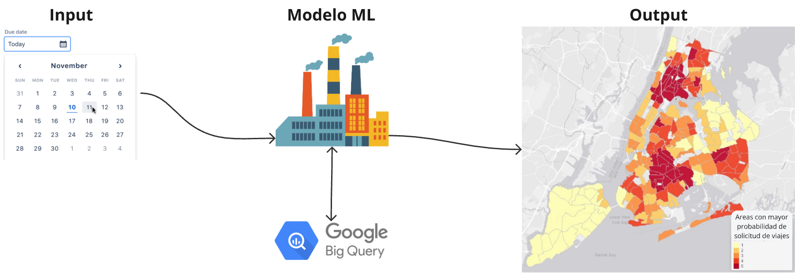

# Producto ML

## Descripción
El **producto de Machine Learning** se desplegará en una **aplicación web** donde el usuario podrá **ingresar una fecha** y el modelo de Machine Learning **predecirá**, lo más cercano posible, las **áreas con mayor probabilidad de solicitud de viajes**, esto se representará en un mapa de calor de Google Maps.

|  |
|:-: |
|Diagrama a Bloques del Producto de ML |
